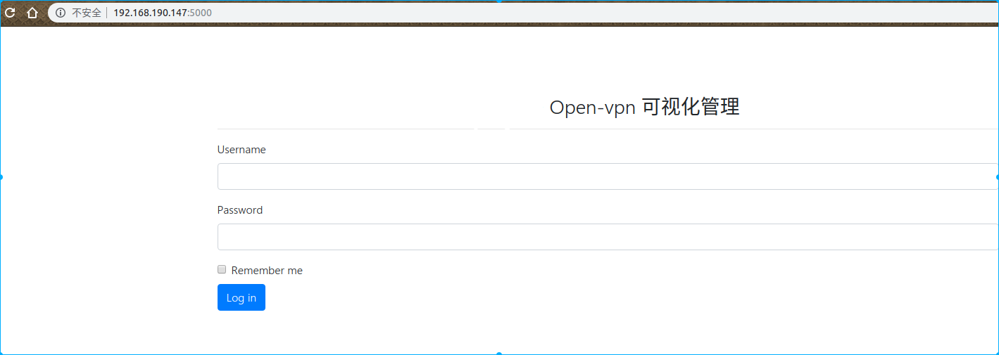
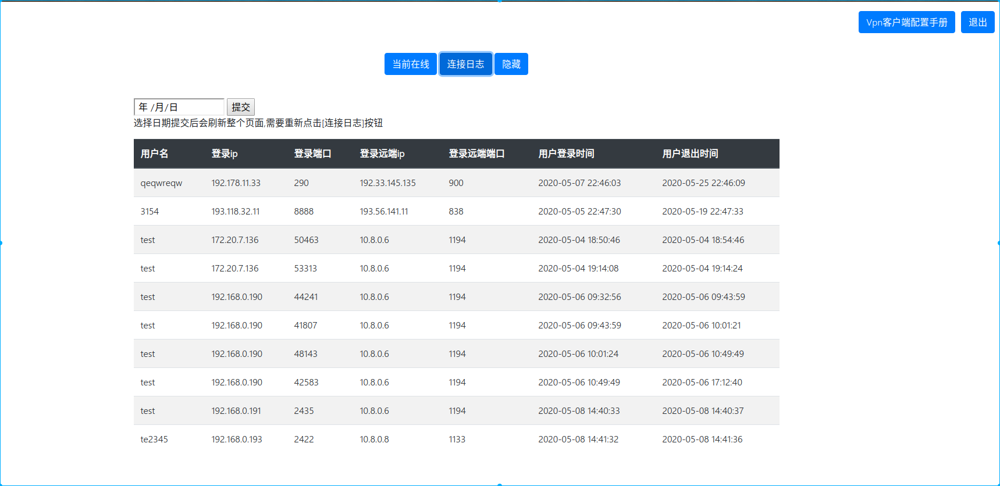
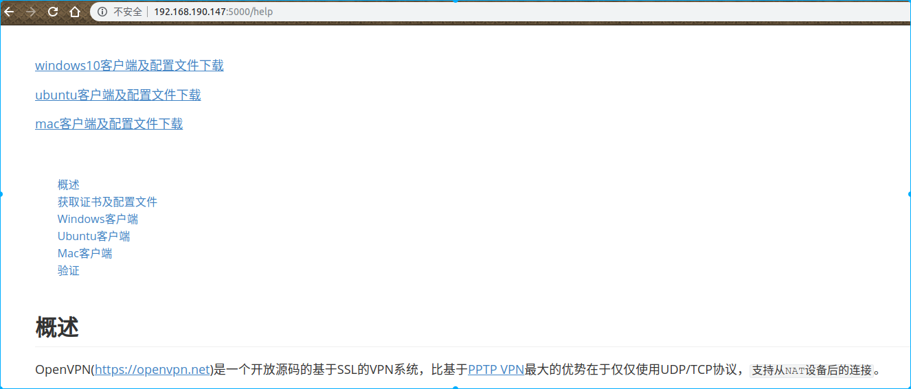

---

---

#### 1,百度翻译

百度翻译美国生活,在百度翻译提供的基础上修改了代码,达到复用http链接的效果,不然多次请求后关闭造成对方无法连接

#### 2,获取网易云音乐评论截图

获取评论截图后还可以生成gif

#### 3,flask-openvpn-UI

在openvpn使用MySQL方面参考了https://github.com/Chocobozzz/OpenVPN-Admin

#### 4,jenkins pdf

#### 5,openvpn可视化管理

2020-6-3

将openvpn的账号信息写入数据库, 通过脚本验证账号信息,验证通过就写入日志,并设在用户在线,用户退出vpn后,设置状态为离线,并在登录的日志里写入退出时间.

管理员账号为admin/123456

此外普通用户还可以修改自己密码,管理员批量添加密码固定123456的账号.