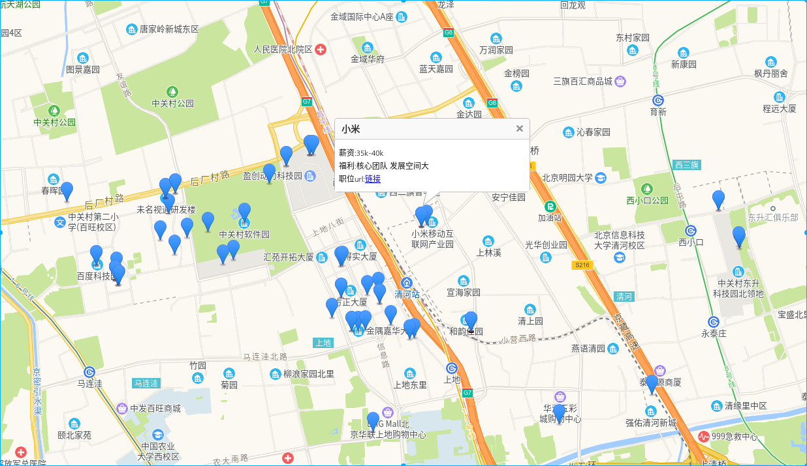

---

---

#### 1,百度翻译

百度翻译美国生活,在百度翻译提供的基础上修改了代码,达到复用http链接的效果,不然多次请求后关闭造成对方无法连接

#### 2,获取网易云音乐评论截图

获取评论截图后还可以生成gif

#### 3,flask-open-UI

使用MySQL方面参考了https://github.com/Chocobozzz/OpenVPN-Admin

#### 4,可视化管理

2020-6-3

将openvpn的账号信息写入数据库, 通过脚本验证账号信息,验证通过就写入日志,并设在用户在线,用户退出vpn后,设置状态为离线,并在登录的日志里写入退出时间.

管理员账号为admin/123456

此外普通用户还可以修改自己密码,管理员批量添加密码固定123456的账号.

#### 5,scrapy 小例子

scrapy 目录小例子:
example初级学习
jiandann煎蛋爬取图片
lianjia-other链家成交数据爬取_别人的例子
lianjia  自己写,北京地区爬取

#### 6,爬取拉钩

lagousipder 爬取拉钩职位并保存于mongodb数据库,其中在抓取职位具体描述的时候可以使用自建代理池.

参考:   https://github.com/KeerZhou/crawllagou.git

#### 7,高德地图展示

根据上一个项目的数据,组成特别的数据格式后可以在高德地图上展示

